## Background

### REpresentational State Transfer

REST, or REpresentational State Transfer, is an architectural style for providing standards between computer systems on the web, making it easier for systems to communicate with each other. REST-compliant systems, often called RESTful systems, are characterized by how they are stateless and separate the concerns of client and server. We will go into what these terms mean and why they are beneficial characteristics for services on the Web.

### Separation of Client and Server

In the REST architectural style, the implementation of the client and the implementation of the server can be done independently without each knowing about the other. This means that the code on the client side can be changed at any time without affecting the operation of the server, and the code on the server side can be changed without affecting the operation of the client.

As long as each side knows what format of messages to send to the other, they can be kept modular and separate. Separating the user interface concerns from the data storage concerns, we improve the flexibility of the interface across platforms and improve scalability by simplifying the server components. Additionally, the separation allows each component the ability to evolve independently.

By using a REST interface, different clients hit the same REST endpoints, perform the same actions, and receive the same responses.

### Statelessness

Systems that follow the REST paradigm are stateless, meaning that the server does not need to know anything about what state the client is in and vice versa. In this way, both the server and the client can understand any message received, even without seeing previous messages. This constraint of statelessness is enforced through the use of resources, rather than commands. Resources are the nouns of the Web - they describe any object, document, or thing that you may need to store or send to other services.

Because REST systems interact through standard operations on resources, they do not rely on the implementation of interfaces.

These constraints help RESTful applications achieve reliability, quick performance, and scalability, as components that can be managed, updated, and reused without affecting the system as a whole, even during operation of the system.

Now, we’ll explore how the communication between the client and server actually happens when we are implementing a RESTful interface.

### Communication between Client and Server

In the REST architecture, clients send requests to retrieve or modify resources, and servers send responses to these requests. Let’s take a look at the standard ways to make requests and send responses.

### Making Requests

REST requires that a client make a request to the server in order to retrieve or modify data on the server. A request generally consists of:

* an HTTP verb, which defines what kind of operation to perform
* a header, which allows the client to pass along information about the request
* a path to a resource
* an optional message body containing data

### HTTP Verbs

There are 4 basic HTTP verbs we use in requests to interact with resources in a REST system:

* GET — retrieve a specific resource (by id) or a collection of resources
* POST — create a new resource
* PUT — update a specific resource (by id)
* DELETE — remove a specific resource by id

## Configure your machine

To complete this project verify you have the following done:

* Do you have ? [HomeBrew](https://brew.sh/)
* Do you have Xcode installed? [Xcode](https://apps.apple.com/us/app/xcode/id497799835?mt=12)
* Do you have Postman? [Download Postman](https://www.postman.com/downloads/)
* Do you have Node installed? [Install Node](https://changelog.com/posts/install-node-js-with-homebrew-on-os-x)
* Do you have Expo installed? [Install Expo](https://docs.expo.io/get-started/installation/)


## Creating a Server

We are going to get started by creating a server that will feed data to our mobile application.

#### Step One

In this repository create a folder for your `node` application, and then change directories to the created folder.

```
mkdir server && cd server
```

Now it is time to initialize the folder to be a `node` application.

```
npm init
```

Open this folder in Visual Studio Code, you can do this manually, or you can use the terminal short cut:

First make sure you are in the correct folder by entering the folowing command :

> Print Working Directory is the command that will print out your current file directory location inside of terminal.

```
pwd
```

Your screen should look like this if you did everything correct.

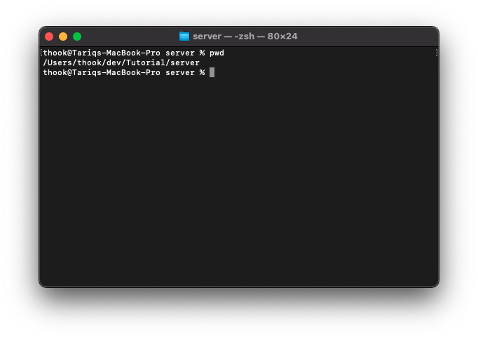

As of right now this is just an empty folder, lets initialize it as a `node` directory.

To do this we use nodes initialization command. Let's do that now inside the server folder:

```
npm init
```

When you run this command, just follow the prompts and either hit enter or type in what you would prefer. Your screen should look as follows:

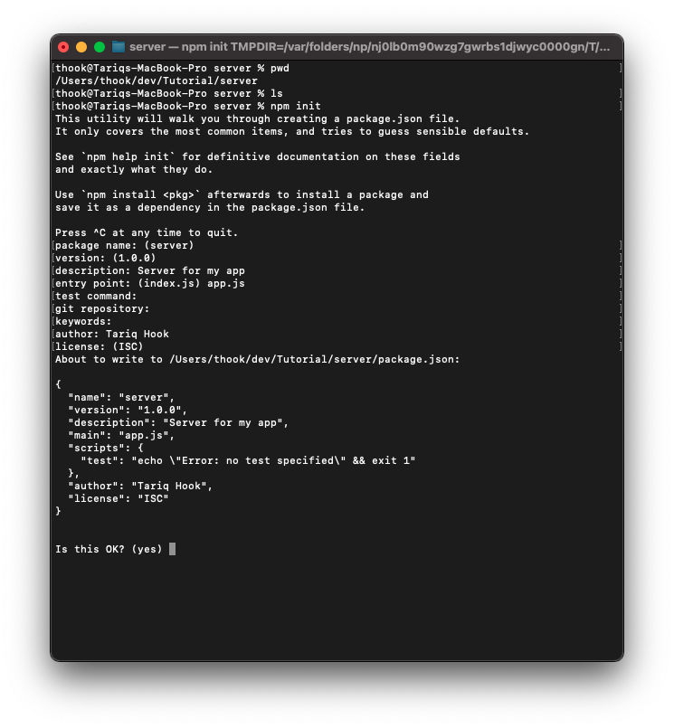

Now its time to move to Visual Studio Code, even though you can open your project from visual studio code directly from the command line by doing the following command from inside of the project folder:

```
code .
```

#### Step Two

> Typing code and any directory path will have code open to that working directory, by typing . it will open the current folder.

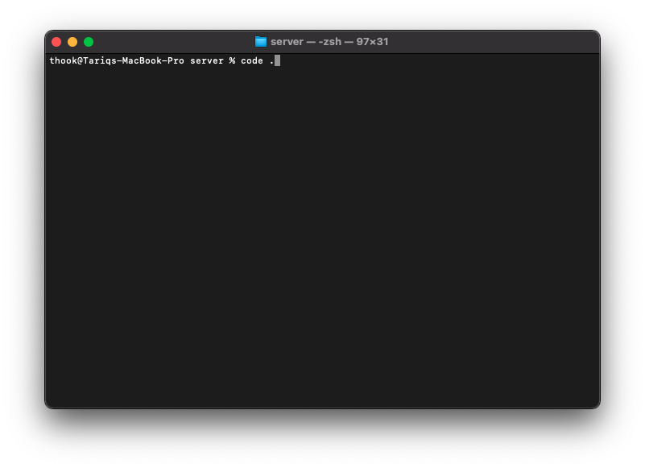

Doing the above will result in Visual Studio Code opening, it should look as following:

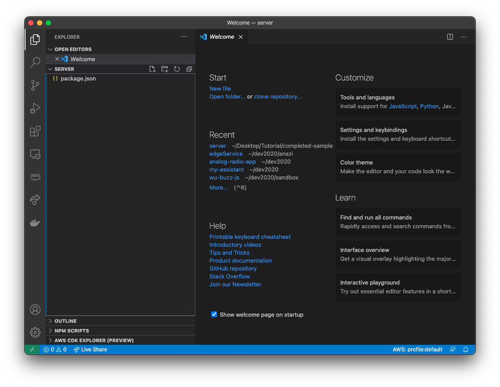

The only file that is in your project is `package.json`

```
{
  "name": "server",
  "version": "1.0.0",
  "description": "Server for my app",
  "main": "app.js",
  "scripts": {
    "test": "echo \"Error: no test specified\" && exit 1"
  },
  "author": "Tariq Hook",
  "license": "ISC"
}

```

This file is the heart of your application, these values can change how your application functions. Understanding this file is critical to your ability to create applications. 

Let's start updating this file now to add some functionality, open up the terminal inside of Visual Studio Code and type in the following:

```
npm install express --save
```

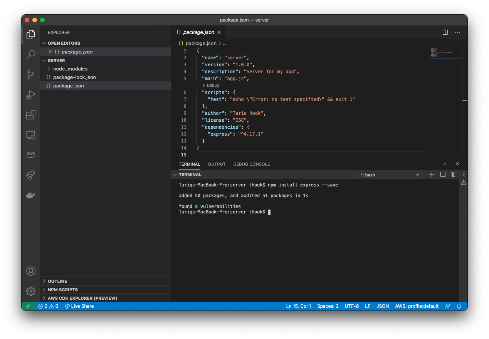

Lets look at the changes :

```
{
  "name": "server",
  "version": "1.0.0",
  "description": "Server for my app",
  "main": "app.js",
  "scripts": {
    "test": "echo \"Error: no test specified\" && exit 1"
  },
  "author": "Tariq Hook",
  "license": "ISC",
  "dependencies": {
    "express": "^4.17.1"
  }
}
```

Notice how there is a new key `dependencies` , the command we just ran installed these dependencies. When you need to add new functionality, this is how it is done, please do not enter dependencies manually, until you become more comfortable in creating applications.

We want to add one more dependency to help in our development, so let us add Nodemon. Nodemon is an application that will let us live develop and see all our changes, without restarting the application. We will install this differently, because we will only want to use this during development.

To use Nodemon, you have to install it on your machine, and inside of your project. To install on your machine you should run the command below:

```
npm install -g nodemon
```

If you have installed this before, you can skip the above command. This is a command you only have to run once per device.

Now the next command you have to run for every new Node project:

```
npm install nodemon --save-dev
```

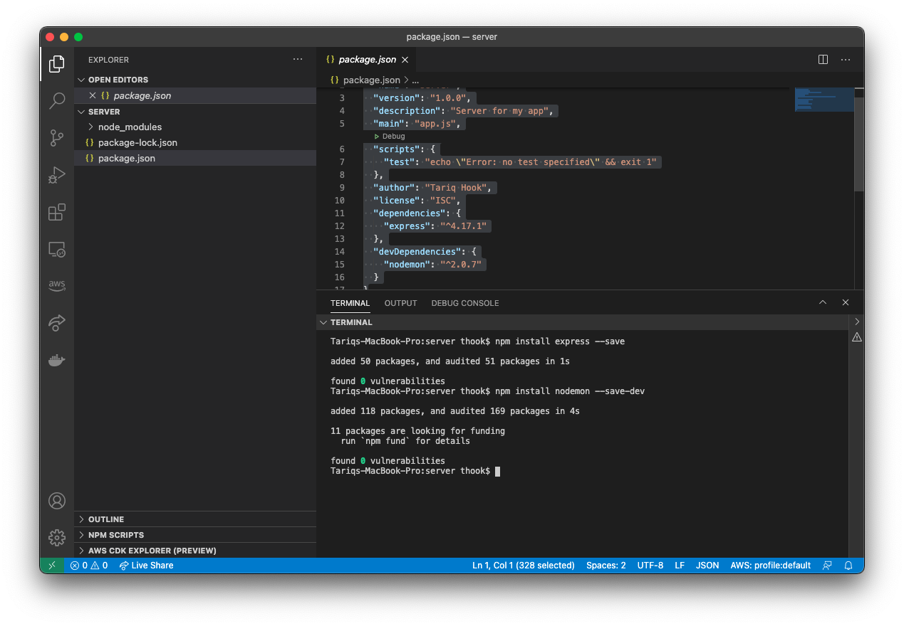

```
{
  "name": "server",
  "version": "1.0.0",
  "description": "Server for my app",
  "main": "app.js",
  "scripts": {
    "test": "echo \"Error: no test specified\" && exit 1"
  },
  "author": "Tariq Hook",
  "license": "ISC",
  "dependencies": {
    "express": "^4.17.1"
  },
  "devDependencies": {
    "nodemon": "^2.0.7"
  }
}
```

Notice the changes in our package.json file, we have a new key `devDependencies`. This will only include nodemon when our project is in development mode, when we deploy it to production it will be excluded.

Now we are ready to cook!!!!

#### Step Three

Let's create a new file called `App.js`, normally you would create the new file using Visual Studio Code, however lets create a file using terminal.

```
touch App.js
```

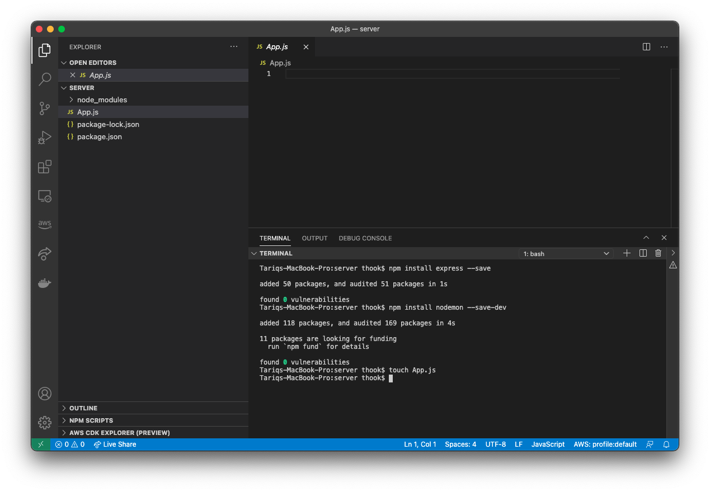

The `touch` command is used to create a new file.

Let's get our server up and running for the first time. Add the code below to the `App.js` file.


```
const express = require("express");
const app = express();

app.listen(3001,()=>{
    console.log("All Systems are go!!");
});

```

Now let's get this up and running!!!

Run the following command in terminal to get your server started:


```
nodemon App.js
```

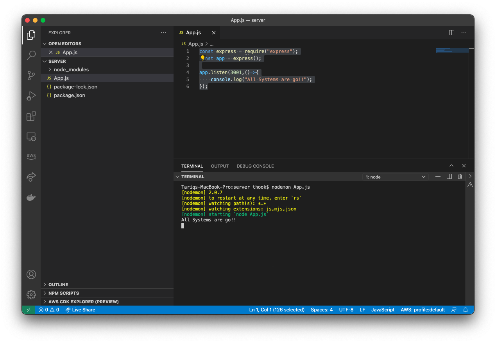

Your server is up and running, lets go and visit it in the browser

In your browser navigate to the following:

```
http://localhost:3001/
```

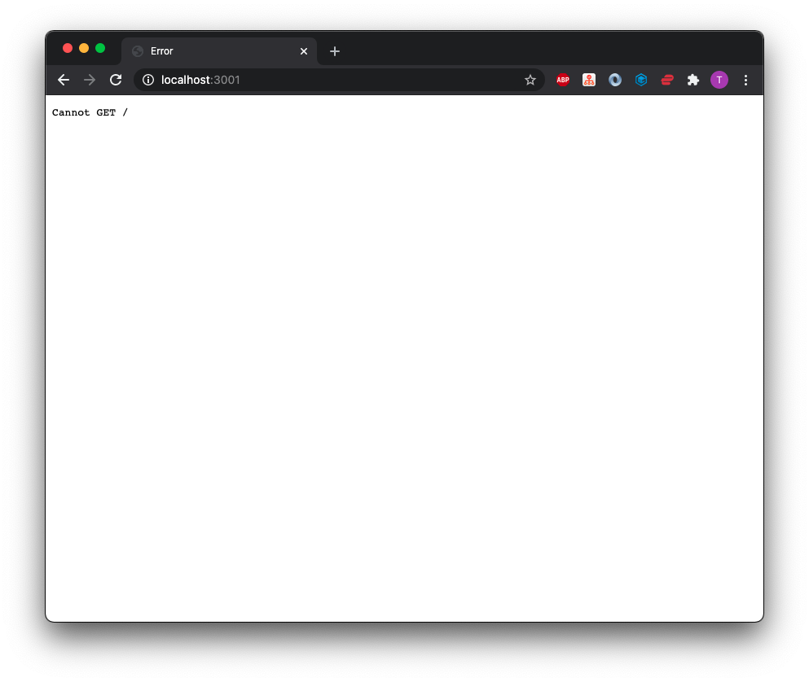

Even though we have an error page, it is actually an amazing thing. Since we have not set up a any approved paths to request data, node blocks all request. Let's approve a request.

Update your App.js file :


```
const express = require("express");
const app = express();

app.listen(3001,()=>{
    console.log("All Systems are go!!");
});

app.get("/", (req, res, next)=>{
    res.json({
        "message":"Hello World"
    })
})

```

Refresh your browser, and see the result:

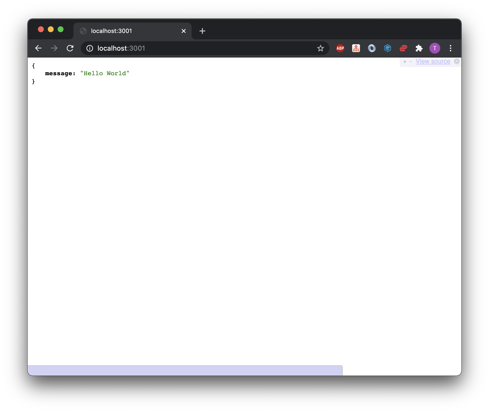

What we have done is taken the first steps in creating a RESTful service. Let's add a little more information for our mobile application to consume:

```
const express = require("express");
const app = express();

app.listen(3001,()=>{
    console.log("All Systems are go!!");
});

app.get("/", (req, res, next)=>{
    res.json({
        "message":"Hello World",
        "createdBy":"Tariq Hook",
        "location":"Newark Delaware",
        "favoriteColor":"Blue"
    })
})
```
Feel free to add as much data as you like.

## Creating a Mobile Client

Lets create a expo project, to do that we need to be outside of the `server` folder we creaded. To go up one directory use the command `cd ..` like so:

```
cd ..
```

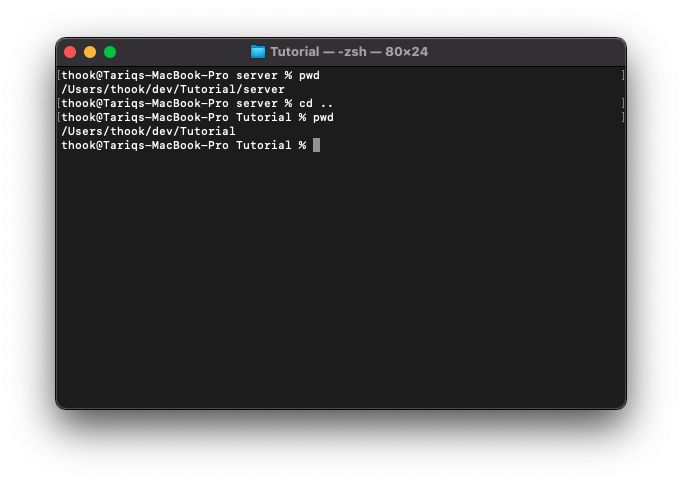

Now from the main directory of your project use the command below to create a mobile app.

```
expo init my-mobile-app
```

Make sure you select blank template.

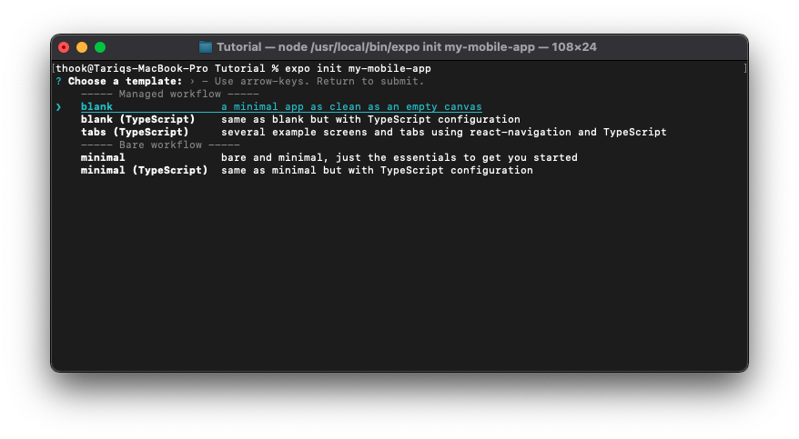

Lets now open that app in a new Visual Studio Code window the same as before:

```
cd my-mobile-app 
code .
```

Replace everthing in App.js with below 

```
import { StatusBar } from 'expo-status-bar';
import React, {useState} from 'react';
import { StyleSheet, Text, View } from 'react-native';

export default function App() {

  const [myData, setMyData] = useState({
    "createdBy": "",
    "favoriteColor": "",
    "location": "",
    "message": "",
  });

  fetch("http://localhost:3001/")
    .then(response => response.json())
    .then(data => {
      setMyData(data);
    });
  
  return (
    <View style={styles.container}>
      <Text>{myData.message}</Text>
      <StatusBar style="auto" />
    </View>
  );
}

const styles = StyleSheet.create({
  container: {
    flex: 1,
    backgroundColor: '#fff',
    alignItems: 'center',
    justifyContent: 'center',
  },
});

```

Now run your app 

```
expo start ios 
```


